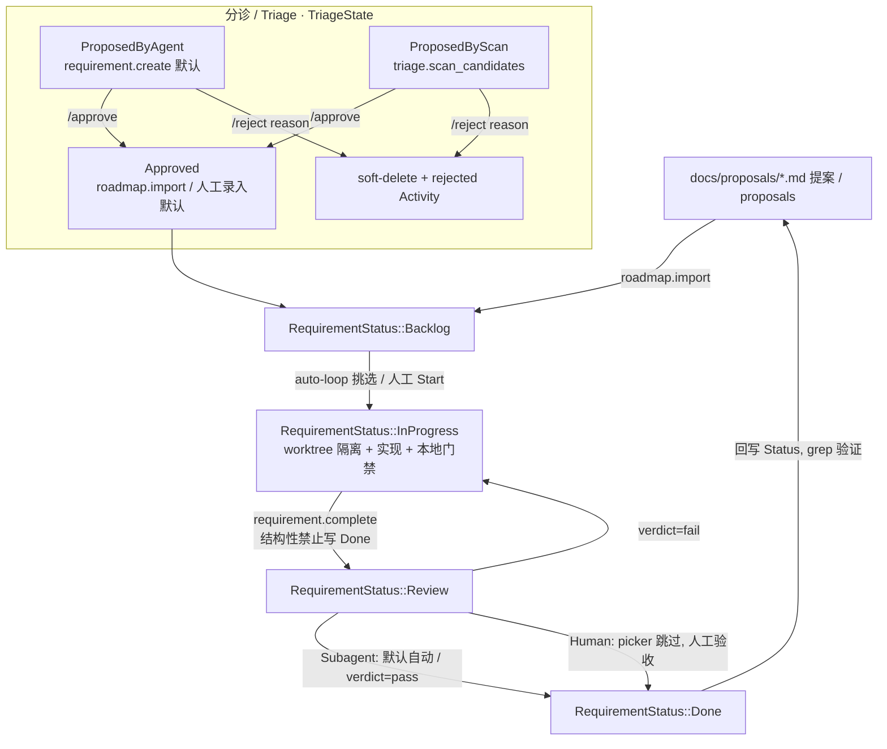

# 研发迭代流程 / R&D Iteration Process

> 版本基准 / Baseline：`feat/chat_spec` @ 2026-05。
>
> 本流程严格对齐 Jarvis 当前的 "Work" 引擎（Requirement 看板 + TriageState 三态分诊 + auto-loop 调度器 + AcceptancePolicy 验收策略 + worktree 隔离），不引入与代码无关的通用流程套话。
> This process is bound to Jarvis's actual "Work" engine (Requirement kanban + 3-way `TriageState` triage + the `auto-loop` scheduler + `AcceptancePolicy` + worktree isolation). Every stage maps to a real state or gate in the code — no generic SCRUM boilerplate.

---

## 1. 概述 / Overview

*Jarvis dogfoods its own Work engine to run its own development.*

Jarvis 本身是一个 Rust agent-runtime 的 Cargo workspace。它内建了一套完整的"工作引擎"（`harness-project` 的 Requirement 看板 + `harness-server` 的 `auto_mode` 调度器 + `harness-requirement` 的执行编排），用来驱动 agent 自动消费需求、跑验证、提交评审。

本流程的核心理念是 **dogfood**：用 Jarvis 自己的 Work 引擎管理 Jarvis 自己的研发迭代。看板列、三态分诊、auto-loop guards、AcceptancePolicy 既是产品特性，也是团队真实工作流——因此文中每个"阶段"都对应代码里的一个真实状态/门禁。

**Goals / 目标：**

- 让一条需求从 `docs/proposals/` 提案 → 看板卡片 → worktree 实现 → 本地质量门禁 → 评审 → Done → 回写提案，全程都有明确的**进入条件 / 产出物 / 退出门禁（gate）**。
  Give every requirement an explicit entry condition / artifact / exit gate at each step, from proposal to Done.
- 明确区分 **Human / Agent(auto-loop) / Reviewer(subagent)** 的边界，并落到具体的 env 配置与 tick guards。
  Pin the Human / Agent / Reviewer boundary to concrete env config and tick guards.
- 把"质量铁律"（`harness-core` 设计单一规则、workspace-deps-only、no-unwrap、clippy `-D warnings`）固化为 PR 合并前 checklist。
  Encode the non-negotiable design rules into a pre-merge checklist.

---

## 2. 角色与职责 / Roles & Responsibilities

分工由 `Requirement.acceptance_policy`（`AcceptancePolicy::Subagent` / `Human`，定义于 `crates/harness-project/src/requirement.rs`）和 auto-loop guards 共同决定。
The split is governed by `Requirement.acceptance_policy` and the auto-loop guards.

| 角色 / Role | 实体 / Entity | 职责 / Responsibility | 硬约束 / Hard constraint |
|------|------|---------|----------------|
| **Human（人类）** | 维护者 / 提案作者 / reviewer | 录入提案、分诊审批（approve/reject）、设计决策、把 Review → Done、合并 PR、回写提案状态 | 唯一能结构性写 `Done` 的角色（`requirement.complete` 被结构性禁止写 Done） |
| **Agent（auto-loop）** | `auto_mode::tick` 调度器 + `Agent::run_stream` | 自动挑 `TriageState::Approved` 且依赖就绪的需求，在隔离 worktree 中实现、验证、推进到 `Review` | 永不自动写 `Done`；只有全部 tick guards 通过才接管 |
| **Reviewer（subagent）** | `subagent.review` 子代理 | Subagent 策略 + `JARVIS_REVIEWER_AUTO_ACCEPT` 开启时，对 Review 行自动评审，终态 `requirement.review_verdict` 决定 `pass`→Done / `fail`→InProgress | 仅在 策略=Subagent + 开关开 + `subagent.review` 已注册 时派发 |

**验收策略的边界影响 / Acceptance policy effects:**

- **`AcceptancePolicy::Subagent`（默认 / default）**：Review → Done 默认**自动翻转**；*除非*设置 `JARVIS_REVIEWER_AUTO_ACCEPT`——此时 picker 重挑该行、重跑 agent（`drive_one`），由 reviewer subagent 的 verdict 决定结果。
  Review → Done auto-flips by default, *unless* `JARVIS_REVIEWER_AUTO_ACCEPT` is set, in which case a reviewer subagent's verdict decides.
- **`AcceptancePolicy::Human`**：卡片**停在 Review**（picker 跳过），等人类验收。用于验证计划无法机器建模的工作。
  The card parks at Review (the picker skips it) for human acceptance — for work a verification plan can't model.

---

## 3. 迭代流程总览 / Flow Overview

看板状态机 `RequirementStatus`（`crates/harness-project/src/requirement.rs`，四列 `Backlog / InProgress / Review / Done`）与三态分诊 `TriageState`（`Approved / ProposedByAgent / ProposedByScan`）正交。
The `RequirementStatus` kanban (4 columns) is orthogonal to the `TriageState` triage.



**关键点 / Key invariants：**

- **分诊三态是调度器专属门禁 / Triage gates are scheduler-only.** 手动 `Start` / 拖拽看板**忽略** TriageState 与 `depends_on`——它们只对 auto-loop 生效。
- 只有 `TriageState::Approved` 的行会被 auto-loop 消费；旧 JSON 行缺该字段时**反序列化为 `Approved`**（向后兼容默认）。
  Only `Approved` rows are consumed by the loop; legacy rows deserialize to `Approved`.
- `requirement.complete` 把卡片翻到 `Review` 并**结构性禁止写 `Done`**——这是人类/subagent 的专属 gate。
  `requirement.complete` can only reach `Review`, never `Done` — the human/subagent gate.

---

## 4. 各阶段详解 / Stage-by-Stage

### 阶段 A — 需求录入与分诊 / Intake & Triage

| 维度 / Dimension | 内容 / Detail |
|------|------|
| **进入条件 / Entry** | 存在提案（`docs/proposals/*.md`，canonical backlog），或 agent/扫描发现候选 |
| **做什么 / Action** | 把提案/候选转成看板上的一张 `Requirement` 卡片，落到正确的 `TriageState` |
| **工具 / Tools** | `roadmap.import` 或 `POST /v1/roadmap/import`（扫描 `docs/proposals/` → `docs/roadmap/` → `roadmap/` → `ROADMAP.md`，每提案 1 卡，建在 `<basename>-roadmap` Project 下，幂等靠隐藏标记 `<!-- roadmap-source: … -->`，zh-CN 合并进英文对等文件，`**Status:**` 关键字映射看板状态）；`triage.scan_candidates`（扫 `TODO/FIXME/XXX/HACK`，不写盘）；`requirement.create`（默认 `triage_state=ProposedByAgent`） |
| **三态 / Triage** | `roadmap.import` / 人工录入默认 `Approved`；`requirement.create` 默认 `ProposedByAgent`；扫描产物 `ProposedByScan` |
| **审批 / Approval** | `POST /v1/requirements/:id/approve`（→ Approved，幂等 `{no_op:true}`）；`POST …/reject`（必须带 `{reason}`，先写 `rejected` Activity 再 soft-delete） |
| **产出物 / Output** | 落在 `Backlog`、带正确 `triage_state` 的 `Requirement` 行；所有变更写 Activity（审计时间线） |
| **退出门禁 / Exit gate** | `triage_state == Approved` 才进入 auto-loop 可消费状态 |

> ⚠️ `requirement.create` 时若用户已确认，应显式传 `triage_state="approved"`，否则停在 `ProposedByAgent`，auto-loop 不接管。
> If the user already confirmed, pass `triage_state="approved"` explicitly — otherwise the loop won't pick it up.

### 阶段 B — 规划 / Planning

| 维度 / Dimension | 内容 / Detail |
|------|------|
| **进入条件 / Entry** | 卡片 `Approved` 且即将/正在实现 |
| **做什么 / Action** | 拆解执行计划，登记 `depends_on` 拓扑依赖，建立 `RequirementTodo` 执行账本 |
| **工具 / Tools** | `plan.update`（推送**完整**最新计划快照——replace 而非 patch——经 `harness_core::plan` task-local → `AgentEvent::PlanUpdate`，web UI 右栏 `PlanList` 渲染）；`Requirement.depends_on: Vec<String>` 声明前置卡片 |
| **依赖语义 / Deps** | auto-loop 拓扑排序，要求 `depends_on` 全部 `Done` 才放行（见 §6） |
| **产出物 / Output** | 计划快照 + 一组 `RequirementTodo`（kind/status/可选 command/依赖/evidence） |
| **退出门禁 / Exit gate** | 计划清晰、依赖已 Done 或显式登记；无 in-flight run 占用 |

### 阶段 C — 实现 / Implementation

| 维度 / Dimension | 内容 / Detail |
|------|------|
| **进入条件 / Entry** | 卡片进入 `InProgress`（auto-loop 挑选或人工 Start/拖拽） |
| **做什么 / Action** | 在**隔离的 git worktree** 中编码实现 |
| **隔离 / Isolation** | `JARVIS_WORKTREE_MODE`（`off` 默认 / `per_run` / `per_unit`）；auto 模式把 `off` 升级为 `per_run`，确保调度器**永不**改动主 checkout。worktree 经 `git worktree add --detach <root>/<run_id>` 从 HEAD 创建，主 checkout 脏时拒绝（除非 `JARVIS_WORKTREE_ALLOW_DIRTY=1`）；root 默认 `<workspace>/.jarvis/worktrees`（`JARVIS_WORKTREE_ROOT` 覆盖）。worktree 路径持久化在 `RequirementRun` 上，支持重启 resume/清理 |
| **并发 / Concurrency** | `JARVIS_WORK_MAX_CONCURRENT`（默认 2，全局上限，tokio `Semaphore`）+ `JARVIS_WORK_MAX_UNITS_PER_TICK`（默认 1，单 tick 突发）。每条 drive 任务调 LLM 前先 `acquire_owned().await` |
| **设计铁律 / Design rules（必守）** | ① `harness-core` 不知道 HTTP / providers / storage / MCP；② 库 crate 绝不读 `std::env`（`apps/jarvis/src/main.rs` 是唯一 composition root）；③ workspace-deps-only（`foo.workspace = true`）；④ 库 crate 内**无 `unwrap`**，返回 `harness_core::Result` / `BoxError`（`apps/jarvis` 可用 `anyhow`）；⑤ 工具命名 `<group>.<verb>`，同名静默覆盖；⑥ 写盘/执行类工具 opt-in + approval-gated（照 `fs.write` / `shell.exec`） |
| **工具 / Tools** | `fs.read/list`（常在）、`fs.write/edit/patch`（opt-in+审批）、`shell.exec`（cwd 指向 `RequirementRun.worktree_path`）、`code.grep`、`git.{status,diff,log,show}` |
| **产出物 / Output** | worktree 内的改动 + 一个 `RequirementRun`（带 `worktree_path`） |
| **退出门禁 / Exit gate** | 本地质量门禁（阶段 D）全绿 |

> 📋 实现→门禁的逐步 SOP 见 **§8**。 The step-by-step SOP for this stage is in **§8**.

### 阶段 D — 本地质量门禁 / Local Quality Gates

| 维度 / Dimension | 内容 / Detail |
|------|------|
| **进入条件 / Entry** | 实现完成，准备推进/提 PR |
| **做什么 / Action** | 本地依次跑通三道 make 门禁；类型跨 SPA 边界时重跑 codegen |
| **命令 / Commands** | `make check` → `make lint`（clippy `-D warnings`，**CI gate**）→ `make test` →（若改 wire-shape 类型）`make ts-codegen` |
| **codegen 约束 / Codegen** | 跨 SPA 边界类型 derive `#[derive(ts_rs::TS)]`，标注只放 owning domain crate（`harness-channel` / `harness-project` / `harness-observability`，**绝不** `harness-core`）；改后必须 `make ts-codegen` 并提交 `apps/jarvis-web/src/types/generated/` 产物 |
| **产出物 / Output** | 三道门禁全绿 + 已重新生成并提交的 TS 类型 |
| **退出门禁 / Exit gate** | **Clippy `-D warnings` 必须 clean**（CI `.github/workflows/rust.yml` 硬门禁） |

### 阶段 E — 评审 / Review

| 维度 / Dimension | 内容 / Detail |
|------|------|
| **进入条件 / Entry** | `requirement.complete` 把卡片翻到 `Review`（结构性禁止写 Done） |
| **做什么 / Action** | 按 `AcceptancePolicy` 走自动或人工评审 |
| **Subagent 路径** | 默认 Subagent：未设 `JARVIS_REVIEWER_AUTO_ACCEPT` 直接自动 Review→Done；设了则 picker 重挑、重跑 `drive_one`，prompt 指示 delegate 给 `subagent.review`，终态 `requirement.review_verdict` 决定 `pass`→Done / `fail`→InProgress。也可经 `POST /v1/requirements/:id/review` 手动派发（校验 Review + Subagent + `subagent.review` 已注册，202 `{dispatched:true}`） |
| **Human 路径** | Human：卡片停 Review，picker 跳过，等人类验收 |
| **人工 PR 评审** | 配合 GitHub PR：审 diff 是否守设计铁律、测试覆盖、clippy clean |
| **产出物 / Output** | 评审结论（verdict / PR review）+ Activity 审计行 |
| **退出门禁 / Exit gate** | Subagent verdict=pass 或人类 approve |

### 阶段 F — 完成与发布 / Done & Release

| 维度 / Dimension | 内容 / Detail |
|------|------|
| **进入条件 / Entry** | 评审通过 |
| **做什么 / Action** | 卡片落 `Done`；合并 PR 触发 CI |
| **Done 门禁** | Review → Done 是**人类/subagent 专属 gate**——agent 端工具结构性无法写 Done |
| **CI 触发 / CI** | `.github/workflows/rust.yml`（push/PR 到 `main`，跑 check+clippy+test）；`release.yml`（`v*` tag 发布）；`desktop-release.yml`（Tauri 桌面构建）。de-facto = trunk-based + PR gate |
| **提交规范 / Commit** | 用户要求时才 commit/push；在默认分支先开分支；commit message 末尾附 `Co-Authored-By` 行 |
| **产出物 / Output** | 合并到 `main`；CI 全绿；必要时打 tag 发版 |
| **退出门禁 / Exit gate** | CI（rust.yml）通过 |

### 阶段 G — 回顾 / 复盘 / Retrospective

| 维度 / Dimension | 内容 / Detail |
|------|------|
| **进入条件 / Entry** | 一条需求 Done 之后 |
| **做什么 / Action** | 回写对应提案的 `**Status:**` 行，清理孤儿 worktree，沉淀经验 |
| **工具 / Tools** | `git worktree list --porcelain` + `GET /v1/diagnostics/worktrees/orphans`；`learning.memory.*` 沉淀长期记忆 |
| **⚠️ 已知坑 / Known pitfall** | `docs/proposals/` 的 `**Status:**` 行**经常滞后**——工作 ship 了状态行还写 "Proposed"。**不要信任状态行**：规划前先 `grep` 模块是否已存在，如 `grep -rn "WorktreeMode" crates/`。 The `**Status:**` lines lag reality — verify by grepping for the module before trusting them. |
| **产出物 / Output** | 更新且经验证的提案状态 + 干净的 worktree 目录 |
| **退出门禁 / Exit gate** | 提案状态与代码现实一致（grep 验证），无残留孤儿 worktree |

---

## 5. PR 合并前 Checklist / Pre-Merge Checklist

合并任何 PR 到 `main` 之前逐项勾选 / Tick every item before merging to `main`:

- [ ] `make check` 通过 / passes (`cargo check --workspace --exclude jarvis-desktop`)
- [ ] `make lint` 通过且 **clippy `-D warnings` 完全 clean** / passes, clippy clean (CI hard gate)
- [ ] `make test` 通过 / passes (`cargo test --workspace --exclude jarvis-desktop`)
- [ ] 若改动跨 SPA 边界类型：已 `make ts-codegen` 并提交 `apps/jarvis-web/src/types/generated/` 产物 / regenerated & committed TS types if wire shapes changed
- [ ] `harness-core` 未引入 HTTP / provider / storage / MCP 知识 / `harness-core` stays pure
- [ ] 库 crate 未读 `std::env`（新 env 只在 `apps/jarvis/src/main.rs` / `serve.rs`）/ no `std::env` in library crates
- [ ] 依赖走 `foo.workspace = true`，版本只在根 `Cargo.toml` 出现一次 / workspace-deps only
- [ ] 库 crate 内无 `unwrap`，错误走 `Result` / `BoxError`；provider 错误包成 `Error::Provider(String)`，不泄漏 `reqwest::Error` / no `unwrap`, no leaked `reqwest::Error`
- [ ] 新工具命名 `<group>.<verb>`；写盘/执行类 opt-in + approval-gated / namespaced & gated tools
- [ ] 新 crate 已加入根 `Cargo.toml` 的 `members` / new crate registered in workspace `members`
- [ ] 新 provider 的 tool-call / tool-result 配对完整（避免中途 400）/ provider preserves tool-call/result pairing
- [ ] 改动看板/分诊语义时：`auto_mode.rs::tests`（含 `reviewer_flag` 用例）通过 / kanban/triage tests pass
- [ ] PR body 末尾附 `🤖 Generated with [Claude Code]`（如适用）/ PR trailer added if applicable

---

## 6. 自动化与人工的边界 / Automation vs Human Boundary

auto-loop（`auto_mode::tick`）是否接管一条需求，由一组 **silent skip** guards 决定（任一不满足即静默跳过）：
Whether the loop picks up a row is decided by a set of silent-skip guards (any unmet → skip):

1. `triage_state == Approved`（`ProposedByAgent` / `ProposedByScan` 跳过）
2. `assignee_id.is_none()`（已指派不抢）
3. 所有 `depends_on` 已到 `Done`（拓扑判定）
4. 当前**无 in-flight run**
5. `failed_count < max_retries`（`JARVIS_WORK_MAX_RETRIES`，默认 1）
6. `AcceptancePolicy::Human` 的 `Review` 行被跳过（留人类验收）

> ⚠️ 手动 `Start` / 拖拽**忽略**第 1、3 条——它们是调度器专属。"人工可强推、自动须守门"。
> Manual `Start`/drag bypasses guards #1 and #3 — they are scheduler-only.

相关 env（仅 `apps/jarvis` 消费）/ Relevant env (consumed only by `apps/jarvis`):

| env | 默认 / Default | 作用 / Purpose |
|-----|------|------|
| `JARVIS_WORK_MODE` | `off` | `auto` 开启自动循环；auto 模式把 worktree `off` 升级为 `per_run` |
| `JARVIS_WORK_TICK_SECONDS` | `30` | 调度 tick 间隔 / scheduler tick interval |
| `JARVIS_WORK_MAX_UNITS_PER_TICK` | `1` | 单 tick 突发上限 / per-tick burst |
| `JARVIS_WORK_MAX_CONCURRENT` | `2` | 全局并发上限（tokio `Semaphore`，独立于突发预算）/ true global cap |
| `JARVIS_WORK_MAX_RETRIES` | `1` | 失败重试上限（guard #5）/ retry cap |
| `JARVIS_WORK_RUN_TIMEOUT_MS` | `600000` | 单 run 超时 / per-run timeout |
| `JARVIS_REVIEWER_AUTO_ACCEPT` | off | 开启后 Subagent 策略下 Review 行改走 `subagent.review` 派发；默认关闭（即默认直接自动翻 Done） |
| `JARVIS_WORKTREE_MODE` | `off` | `off`/`per_run`/`per_unit`；隔离 run 的 checkout |
| `JARVIS_WORKTREE_ROOT` | `<workspace>/.jarvis/worktrees` | worktree 根目录 / worktree root |
| `JARVIS_WORKTREE_ALLOW_DIRTY` | off | 允许主 checkout 脏时创建 worktree（安全门，默认拒绝）/ allow dirty main checkout |

**边界总结 / Bottom line：** 自动化负责"把 Approved 且依赖就绪的卡片在隔离 worktree 中跑到 Review"；人类负责"分诊审批 + 把 Review 跑到 Done + 合并发布"；reviewer subagent 只是 Subagent 策略下的可选自动验收加速器。
Automation drives Approved-and-ready cards to Review in an isolated worktree; humans triage, accept Review→Done, and merge; the reviewer subagent is an optional accelerator under the Subagent policy.

---

## 7. 关键命令速查表 / Command Cheat Sheet

```bash
# —— 本地质量门禁（与 CI 对齐）/ Local gates (mirror CI) ——
make check            # cargo check  --workspace --exclude jarvis-desktop
make lint             # cargo clippy --workspace --all-targets --exclude jarvis-desktop -- -D warnings  (CI gate)
make test             # cargo test   --workspace --exclude jarvis-desktop
make ts-codegen       # 改动跨 SPA 边界类型后重新生成 / regen TS types after wire-shape change

# —— 按路径过滤测试 / Filtered tests ——
cargo test -p harness-core message::           # 过滤单 crate / 模块
cargo test -p harness-server auto_mode         # 调度器 guards / reviewer_flag 用例

# —— 运行 / 构建 / Run & build ——
cargo run -p jarvis                            # 需 OPENAI_API_KEY（或对应 provider key）
cargo build --release -p jarvis

# —— 启动 auto-loop（dogfood 自身工作引擎）/ Start the auto-loop ——
JARVIS_WORK_MODE=auto \
JARVIS_WORKTREE_MODE=per_run \
JARVIS_WORK_MAX_CONCURRENT=2 \
  cargo run -p jarvis -- serve --workspace .

# —— 提案/分诊 / Intake & triage ——
curl -X POST localhost:7001/v1/roadmap/import                  # docs/proposals → 看板卡片（幂等）
curl -X POST localhost:7001/v1/requirements/<id>/approve       # ProposedBy* → Approved
curl -X POST localhost:7001/v1/requirements/<id>/reject -d '{"reason":"..."}'

# —— worktree 健康检查 / 清理孤儿 / Worktree health ——
git worktree list --porcelain
curl localhost:7001/v1/diagnostics/worktrees/orphans

# —— 回顾：验证提案状态（Status 行常滞后）/ Retro: verify proposal status ——
grep -rn "WorktreeMode\|<模块名>" crates/        # 用代码现实校准 **Status:** 行

# —— MCP 模式（无 LLM/HTTP）/ MCP mode ——
cargo run -p jarvis -- --mcp-serve
```

---

## 8. 实现→门禁 step-by-step SOP / Implementation→Gate SOP

*The daily-driver loop: from picking up a card to a green local gate. This expands stages C–D into a concrete checklist.*

下面是开发者从"接卡片"到"本地门禁全绿"的逐步操作手册，把阶段 C–D 展开成可照做的流程。手动开发（人工 Start）与 auto-loop 自动驱动两条路径并列说明。

### 8.1 接卡片 / Pick up the card

**人工 / Manual：**
1. 在看板上把目标卡片从 `Backlog` 拖到 `InProgress`（或 `POST /v1/requirements/:id/runs` 起一个新 run）。手动 Start **忽略** TriageState 与 `depends_on` 门禁——你为越门负责。
2. 确认这条需求的 `depends_on` 前置确实满足（手动路径不自动校验，自己核对）。

**自动 / auto-loop：** 调度器在 §6 的 6 条 guards 全过时自动接管；你无需操作，只需保证卡片 `triage_state == Approved`、未被指派、依赖已 Done。

### 8.2 建立隔离工作区 / Create the isolated worktree

- **自动模式**会按 `JARVIS_WORKTREE_MODE`（auto 下至少 `per_run`）自动 `git worktree add --detach <root>/<run_id>`，从 HEAD 拉一份隔离 checkout，路径写进 `RequirementRun.worktree_path`。主 checkout 脏 → 拒绝创建（除非 `JARVIS_WORKTREE_ALLOW_DIRTY=1`）。
- **人工开发**建议同样隔离，避免污染主 checkout：
  ```bash
  git worktree add -b feat/<requirement-slug> .jarvis/worktrees/<slug>
  cd .jarvis/worktrees/<slug>
  ```
  > 在默认分支上直接改动是反模式——先开分支。Never work directly on the default branch.

### 8.3 实现，守住设计铁律 / Implement under the design rules

边写边自检（这些是 clippy/review 之外、机器较难全自动抓的约束）：

| 检查项 / Check | 怎么自检 / How |
|------|------|
| `harness-core` 不碰 HTTP/provider/storage/MCP | 改 `harness-core` 时确认没 `use reqwest` / `use axum` / store 依赖 |
| 库 crate 无 `std::env` | `grep -rn "std::env\|env::var" crates/<your-crate>/src/` 应为空；新 env 只加在 `apps/jarvis/src/main.rs` 或 `serve.rs` |
| workspace-deps-only | 新依赖加到根 `Cargo.toml` `[workspace.dependencies]`，crate 内写 `foo.workspace = true` |
| 无 `unwrap`（库 crate） | `grep -rn "unwrap()\|expect(" crates/<your-crate>/src/`；用 `?` + `harness_core::Result` / `BoxError` 替换 |
| 工具命名 `<group>.<verb>` | 新工具名带命名空间，避免静默覆盖既有同名工具 |
| 写盘/执行类工具 opt-in + 审批 | 照 `fs.write` / `shell.exec`：默认关闭，`requires_approval()` 返回 true |
| 跨 SPA 边界类型加 `ts_rs::TS` | 仅在 `harness-channel`/`harness-project`/`harness-observability` 标注，**绝不** `harness-core` |

实现时优先用只读工具勘察（`code.grep` / `fs.read` / `git.diff`），写改动用 `fs.edit`/`fs.patch`（审批门），验证命令用 `shell.exec`（cwd 自动指向 worktree）。

### 8.4 本地质量门禁 / Run the local gates

在 worktree 根目录按顺序跑，**任一失败就停下来修，不要带着红灯往后走**：

```bash
make check     # 1) 编译过
make lint      # 2) clippy -D warnings —— 这是 CI 硬门禁，必须 clean
make test      # 3) 测试过；改了调度/分诊则确认 auto_mode reviewer_flag 用例
```

若本次改动触及跨 SPA 边界的 wire-shape 类型（REST/WS payload、localStorage 形状），追加：

```bash
make ts-codegen        # 重新生成
git status apps/jarvis-web/src/types/generated/   # 必须提交产物，diff 不为空才算改完
```

> 顺序固定：check → lint → test → (ts-codegen)。lint 红灯在 CI 必挂，本地先解决最省事。
> Fixed order; clippy red == CI failure, so clear it locally first.

### 8.5 补测试 / Add tests

- 新逻辑就近放 `#[cfg(test)] mod tests`（项目以 inline 单元测试为主）。
- 改了调度器/分诊语义：跑并补 `crates/harness-server/src/auto_mode.rs` 下的测试，尤其 `reviewer_flag` 前缀用例。
- 改了 provider：补 conversation ↔ wire 的转换测试，确认 tool-call/tool-result 配对不丢（这是中途 400 的常见根因）。
- 定向跑：`cargo test -p <crate> <filter>`。

### 8.6 推进到 Review / Hand off to Review

- **agent 路径**：调 `requirement.complete` 把卡片翻到 `Review`（该工具结构性无法写 Done）。
- **人工路径**：把卡片拖到 `Review`，并按需开 PR（push 分支 → `gh pr create`，body 末尾附 `🤖 Generated with [Claude Code]`）。
- 然后交给阶段 E：Subagent 策略下默认/经 `subagent.review` 自动判，Human 策略下等人验收。
- **结构性事实**：你（实现者/agent）永远到不了 `Done`——那一步是人类或 reviewer subagent 的专属 gate。

### 8.7 收尾自检 / Done definition（本 SOP 的退出标准）

- [ ] worktree 内 `make check && make lint && make test` 全绿
- [ ] 触及 wire-shape 类型则 `make ts-codegen` 产物已提交
- [ ] §5 Checklist 全部勾选
- [ ] 卡片已到 `Review`（agent 经 `requirement.complete`；人工经拖拽/PR）
- [ ] 完成 Done 后回到阶段 G：回写提案 `**Status:**`（grep 验证），`git worktree remove` 或 `GET /v1/diagnostics/worktrees/orphans` 清理隔离目录
