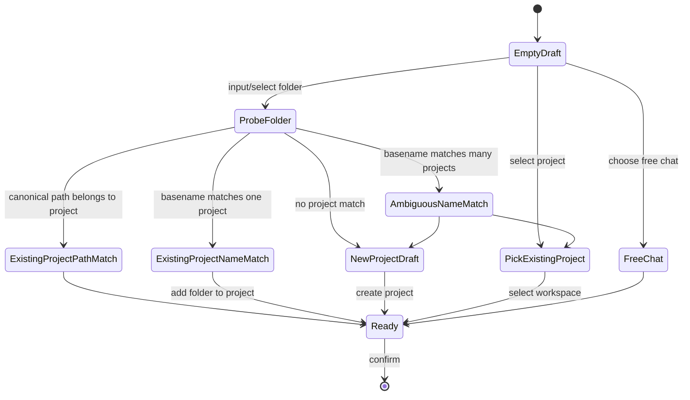

# 新建会话资源管理弹框

**状态：** Proposed  
**涉及：** `apps/jarvis-web` 的新建会话 composer、Project / Workspace 选择体验、
`crates/harness-server` 的 workspace 探测与项目创建接口、`harness-core::Project`
已有的 `workspaces` 字段、`harness-store::WorkspaceStore` 的 recent workspace 注册表。

## 背景

新建会话和会话中不是同一种 UI。

- **新建会话**需要帮助用户决定“这次聊天绑定哪个资源”：本地运行时、项目、一个或多个
  工作区文件夹、是否只是 Free chat。
- **会话中**则应该更像 Claude Code：显示当前 git branch、diff、PR 入口和紧凑输入框。

当前新建会话 composer 已经有上下文胶囊：

```text
Local | Jarvis | feat/new | Free chat | +
```

但它还缺一个完整的资源管理入口。用户真正想做的是：

1. 选择一个已有项目；
2. 选择一个本地文件夹；
3. 如果这个文件夹还没有项目，Jarvis 自动按文件夹名创建项目；
4. 同一个项目可以绑定多个文件夹；
5. 如果多个文件夹名称相同，不能靠名字含糊匹配，必须能清楚区分路径；
6. 最终新建会话时，Project 与 active workspace 都应明确绑定。

这份 spec 只处理**新建会话资源选择**。会话中 composer 的 Claude Code 风格属于另一个
状态，不在这里改变。

## 目标

1. **新建会话资源选择一站完成。**  
   用户点击新建会话的 workspace/project/+ 胶囊后，进入同一个资源管理弹框，而不是在多个
   小 popover 中来回跳。

2. **项目与文件夹都可以作为入口。**  
   用户可以先选项目，再选该项目下的文件夹；也可以先选文件夹，让 Jarvis 自动创建或关联项目。

3. **自动创建项目但不擅自隐藏决策。**  
   当文件夹没有匹配项目时，弹框展示“将创建项目：`<folder name>`”，用户确认后再创建。

4. **项目支持多个文件夹。**  
   一个 Project 可绑定多个 `ProjectWorkspace`，新建会话只选择其中一个作为 active workspace，
   但会保留该项目的完整 workspace 列表。

5. **同名文件夹必须路径可辨。**  
   列表主标题可以是 folder basename，但副标题必须显示短路径；选择和去重按 canonical path。

6. **保留 Free chat。**  
   用户可以明确选择“不绑定项目，仅使用当前/指定 workspace”或“完全 Free chat”。

## 非目标

- 不做系统级原生文件选择器的强依赖。Web UI 第一版仍以路径输入、recent workspaces、
  项目已绑定 workspaces 为主。
- 不在第一版实现全盘目录浏览器或文件树。
- 不自动扫描用户磁盘创建项目。
- 不改变会话中 composer 的 Claude Code 样式。
- 不把 Project 创建逻辑塞进 `harness-core`。`harness-core` 仍只是值类型和 trait。

## 核心概念

### Resource Selection

新建会话的资源选择可以表示成：

```ts
type NewSessionResourceSelection =
  | {
      mode: "free_chat";
      workspacePath: string | null;
      projectId: null;
    }
  | {
      mode: "existing_project";
      projectId: string;
      workspacePath: string | null;
    }
  | {
      mode: "new_project_from_folder";
      projectDraft: {
        name: string;
        slug?: string;
        instructions?: string;
      };
      workspacePath: string;
    };
```

说明：

- `workspacePath` 是本次会话实际执行工具的根目录；
- `projectId` 是要注入项目上下文的 Project；
- Project 可以有多个 `workspaces`，但单个 Conversation 仍只有一个 active workspace；
- 如果选了已有 Project 但没有选 workspace，默认使用：
  1. 该 Project 的第一个 workspace；
  2. 否则当前 server workspace；
  3. 否则 `null`，只绑定 Project instructions。

### Project Workspace

已有模型已支持：

```rust
pub struct ProjectWorkspace {
    pub path: String,
    pub name: Option<String>,
}
```

本 spec 不新增核心模型字段。只要求 UI 和 REST 层更好地使用它。

## 产品体验

### 新建会话 composer

新建会话时继续保留上下文胶囊：

```text
[Local] [Workspace] [Branch] [Project / Free chat] [+]
[输入框]
[Mode / + / Usage]                         [Model]
```

点击以下任一入口都打开资源管理弹框：

- Workspace 胶囊；
- Project / Free chat 胶囊；
- `+` 胶囊。

区别只在默认 tab：

| 入口 | 弹框默认焦点 |
|---|---|
| Workspace 胶囊 | 文件夹 / workspace 搜索 |
| Project / Free chat 胶囊 | 项目搜索 |
| `+` 胶囊 | 最近资源总览 |

### 资源管理弹框

建议标题：**选择会话资源** / **Session resources**

弹框布局：

```text
┌──────────────────────────────────────────────────────────────┐
│ 选择会话资源                                                  │
│ [搜索项目或文件夹路径…                                      ] │
│                                                              │
│ 左侧：资源类型                 右侧：选择与预览              │
│ ─────────────────────────     ─────────────────────────────  │
│ • 最近                         当前选择                      │
│ • 项目                         Project: Jarvis               │
│ • 文件夹                       Workspace: ~/GitHub/Jarvis     │
│ • Free chat                    Branch: feat/new · dirty       │
│                                                              │
│ 最近资源                                                     │
│  Jarvis                         /Users/.../GitHub/Jarvis      │
│  Jarvis                         /Users/.../Work/Jarvis        │
│                                                              │
│ 项目                                                     [+]  │
│  Jarvis                         3 folders · 18 conversations  │
│                                                              │
│ 文件夹                                                        │
│  ~/Documents/GitHub/Jarvis       git · feat/new · dirty       │
│  ~/Desktop/Jarvis                git · main · clean           │
│                                                              │
│ [取消]                                  [使用 Free chat] [确认]│
└──────────────────────────────────────────────────────────────┘
```

### 交互细节

#### 1. 选择已有项目

用户在“项目”列表点击 Project：

- 如果 Project 有 workspaces：
  - 右侧预览显示所有 folders；
  - 默认选第一个 folder；
  - 用户可以切换 active workspace；
  - 用户可以追加新的 folder 到这个 Project。
- 如果 Project 没有 workspaces：
  - 右侧显示“此项目还没有文件夹”；
  - 提供“选择文件夹”输入；
  - 确认后将该 folder 写入 Project 的 `workspaces`。

确认后：

```text
draftProjectId = project.id
draftWorkspacePath = selectedWorkspace.path 或 null
```

#### 2. 选择文件夹并自动创建项目

用户输入或选择一个 folder：

1. UI 调用 `probeWorkspace(path)`；
2. server 返回 canonical root + git 状态；
3. UI 用最后一段路径生成默认项目名，例如：
   - `/Users/a/code/Jarvis` → `Jarvis`
   - `/Users/a/work/mono/apps/admin` → `admin`
4. UI 查找现有 Project：
   - 如果某个 Project 已绑定这个 canonical path：建议选择该 Project；
   - 如果没有 path 命中但存在同名 Project：提示“同名项目存在，是否添加为另一个文件夹？”；
   - 如果没有同名 Project：提示“将创建新项目 `<folder name>`”。

确认策略：

| 场景 | 默认动作 |
|---|---|
| canonical path 已属于某 Project | 选择该 Project + 该 workspace |
| folder basename 命中一个 Project name/slug | 添加 workspace 到该 Project |
| folder basename 命中多个 Project | 要求用户手动选择 Project 或创建新项目 |
| 无命中 | 创建 Project，并把该 folder 作为第一个 workspace |

#### 3. 同名文件夹

同名文件夹必须显示路径差异：

```text
Jarvis
~/Documents/GitHub/Jarvis

Jarvis
~/Desktop/Jarvis
```

去重规则：

- workspace 去重按 canonical path；
- Project name 可重复吗？现有 Project `name` 是 free-form，不要求唯一；
- Project `slug` 必须唯一，冲突时沿用后端已有 `-2`, `-3` 逻辑；
- UI 不允许仅凭 basename 自动合并到多个同名 Project。

#### 4. 多文件夹项目

Project 详情中展示：

```text
Project: Jarvis
Folders:
  ✓ ~/Documents/GitHub/Jarvis       git · feat/new · dirty
    ~/Documents/GitHub/Jarvis-Web   git · main · clean
    ~/Desktop/Jarvis                git · main · clean
```

本次新建会话只能有一个 active workspace。用户在多个 folder 中选择一个，Project 仍保留
全部 folder。

#### 5. Free chat

Free chat 不是“未配置”，而是显式选择：

- `projectId = null`
- `workspacePath` 可以为：
  - 当前 server workspace；
  - 用户选择的 folder；
  - `null`

如果用户选了 folder 但选择 Free chat，Jarvis 只设置 workspace，不创建 Project。

## 前端实现

### 新组件

建议新增：

```text
apps/jarvis-web/src/components/Composer/ResourceManagerDialog.tsx
apps/jarvis-web/src/components/Composer/resourceSelection.ts
```

`ResourceManagerDialog` 负责：

- 搜索项目；
- 搜索/输入 folder path；
- 展示 recent workspaces；
- 展示 Project workspaces；
- 调用 `probeWorkspace`；
- 根据选择生成 `NewSessionResourceSelection`；
- 确认时调用 `applyNewSessionResourceSelection`。

`resourceSelection.ts` 负责纯函数：

- `folderNameFromPath(path)`；
- `matchProjectsForWorkspace(projects, canonicalPath, basename)`；
- `deriveProjectDraftFromWorkspace(info)`；
- `resolveDefaultWorkspaceForProject(project, baselineWorkspace)`；
- `compactResourceLabel(path)`。

这些纯函数需要单元测试。

### 改造 `ComposerSessionContext`

当前 `ComposerSessionContext` 已经承担 workspace/project picker。新方案：

1. 保留新建会话胶囊的视觉样式；
2. 点击胶囊不再打开多个分散 popover，而是打开 `ResourceManagerDialog`；
3. 弹框确认后更新：

```ts
setDraftProjectId(projectIdOrNull)
setDraftWorkspace(canonicalPathOrNull, workspaceInfoOrNull)
```

临时兼容策略：

- 第一 PR 可以保留旧 popover 代码但不再作为默认入口；
- 第二 PR 删除旧 popover，避免长期双路径。

### Store 状态

建议新增最小状态：

```ts
resourceDialogOpen: boolean;
resourceDialogInitialTab: "recent" | "projects" | "folders";
```

也可以先用 `useState` 放在 `ComposerSessionContext` 内，等弹框被其他入口复用时再上 store。

### 提交会话

`Composer.submit()` 当前已经在新建持久会话时发送：

```ts
{ type: "new", project_id?, workspace_path?, provider?, model? }
```

本 spec 不改变 WS 协议，只保证弹框确认后 `draftProjectId` / `draftWorkspacePath`
是正确的。

## 后端/API 实现

### 已有能力

已有接口基本足够支撑 v1：

- `GET /v1/projects`
- `POST /v1/projects`
- `PUT /v1/projects/:id_or_slug`
- `GET /v1/projects/:id_or_slug/workspaces/status`
- `GET /v1/workspaces`
- `POST /v1/workspaces`
- `GET /v1/workspace/probe?path=...`

### 建议新增：资源解析辅助接口

为了减少前端重复规则，建议新增可选接口：

```http
POST /v1/session-resources/resolve
Content-Type: application/json

{
  "path": "/Users/a/code/Jarvis",
  "project_id": null
}
```

响应：

```json
{
  "workspace": {
    "root": "/Users/a/code/Jarvis",
    "vcs": "git",
    "branch": "feat/new",
    "dirty": true
  },
  "matches": [
    {
      "kind": "path_match",
      "project": { "id": "...", "name": "Jarvis", "slug": "jarvis" }
    }
  ],
  "suggested_action": {
    "kind": "select_existing_project",
    "project_id": "..."
  },
  "project_draft": {
    "name": "Jarvis",
    "slug": "jarvis"
  }
}
```

该接口不是第一版必需；v1 可以先在前端用已有数据完成匹配。但如果后续要给 CLI / mobile
复用，建议把规则下沉到 server。

## 状态机



## 验收标准

### 新建会话 UI

- 新建会话时仍显示原有上下文胶囊，而不是 Claude Code 会话中输入区。
- 点击 workspace / project / `+` 胶囊会打开同一个资源管理弹框。
- 弹框能列出：
  - 最近 workspaces；
  - 已有 Projects；
  - 当前 Project 的多个 folders；
  - Free chat 选项。
- 同名 folder 显示完整或缩短路径，用户能区分。

### 项目与文件夹绑定

- 选择已有 Project 后，可选该 Project 的任意 workspace 作为本次 active workspace。
- 输入新 folder 后，能探测 git branch / dirty 状态。
- 如果 folder path 已属于某 Project，默认选择该 Project。
- 如果 folder basename 无匹配，确认时自动创建 Project，名称来自 folder basename。
- 如果 folder basename 命中多个 Project，必须要求用户手动选择或创建新 Project。
- 同一个 Project 可以绑定多个 canonical workspace path。

### 会话启动

- 发送第一条消息时，WS `new` frame 包含正确的 `project_id` 和 `workspace_path`。
- Free chat 不发送 `project_id`。
- 只选 Project 不选 folder 时，默认 workspace 解析符合本 spec。
- 只选 folder 且选择 Free chat 时，不创建 Project。

### 回归

- 会话中 composer 继续使用 Claude Code 风格 shoulder。
- 新建会话 composer 不显示会话中 shoulder。
- 现有 Project 创建/编辑页面的多 workspace 功能不回退。

## PR 拆分建议

### PR 1：纯函数与弹框骨架

- 新增 `ResourceManagerDialog`；
- 新增 `resourceSelection.ts` + 单元测试；
- 弹框只读展示 projects/recent/workspaces，不提交变更。

### PR 2：接入新建会话 composer

- `ComposerSessionContext` 点击胶囊打开弹框；
- 确认后更新 draft project/workspace；
- 保留旧 popover 作为 fallback。

### PR 3：自动创建/关联项目

- folder → project draft；
- path match / name match / ambiguous match 规则；
- 调用 `createProject` / `updateProject`；
- 覆盖同名 folder / 多 Project 场景测试。

### PR 4：体验打磨

- recent resource 分组；
- 键盘导航；
- loading / error / empty states；
- i18n；
- 移动端布局。

### PR 5：可选 server resolve API

- `POST /v1/session-resources/resolve`；
- 后端统一 canonical path + matching 规则；
- 前端迁移到 server resolve。

## 测试计划

前端单元测试：

- `folderNameFromPath` 支持普通路径、尾随 slash、中文路径、空路径；
- `matchProjectsForWorkspace` 按 canonical path 优先；
- 同名 Project 返回 ambiguous；
- Project 默认 workspace 选择规则；
- Free chat 不生成 Project action。

组件测试：

- 点击三个胶囊都打开同一个 dialog；
- 选择已有 Project 后预览 workspace；
- 输入新 folder 后展示“将创建项目”；
- 同名 folder 展示路径；
- 确认后 store 里的 `draftProjectId` / `draftWorkspacePath` 正确。

后端测试（若实现 resolve API）：

- 不存在路径返回 400；
- 文件路径非目录返回 400；
- path 已绑定 Project 返回 `path_match`；
- basename 多重命中返回 ambiguous；
- 无命中返回 `new_project_from_folder` draft。

## 开放问题

1. Web 是否要接入 `showDirectoryPicker()`？
   - 优点：更像原生选择文件夹；
   - 缺点：浏览器拿到的是 handle，不一定能得到 server 可用的绝对路径；
   - 建议：v1 不依赖它，后续桌面壳层再接。

2. 自动创建 Project 的默认 instructions 写什么？
   - 建议第一版：
     ```text
     Project context for <folder name>.
     Workspace: <canonical path>
     ```
   - 后续可以读取 `AGENTS.md` / `README` 生成更好的初始说明。

3. Project 与 workspace 是否允许多对多？
   - 当前模型是 Project → many workspaces；
   - 同一个 workspace 被多个 Project 引用在技术上可行，但 UI 要提示“该 folder 已在其他项目中使用”。

4. recent workspace 与 Project workspace 的关系？
   - recent 是用户最近用过的 folder；
   - Project workspace 是长期绑定；
   - 同一 path 可以同时出现在两处，但 UI 应合并展示，不重复两行。

