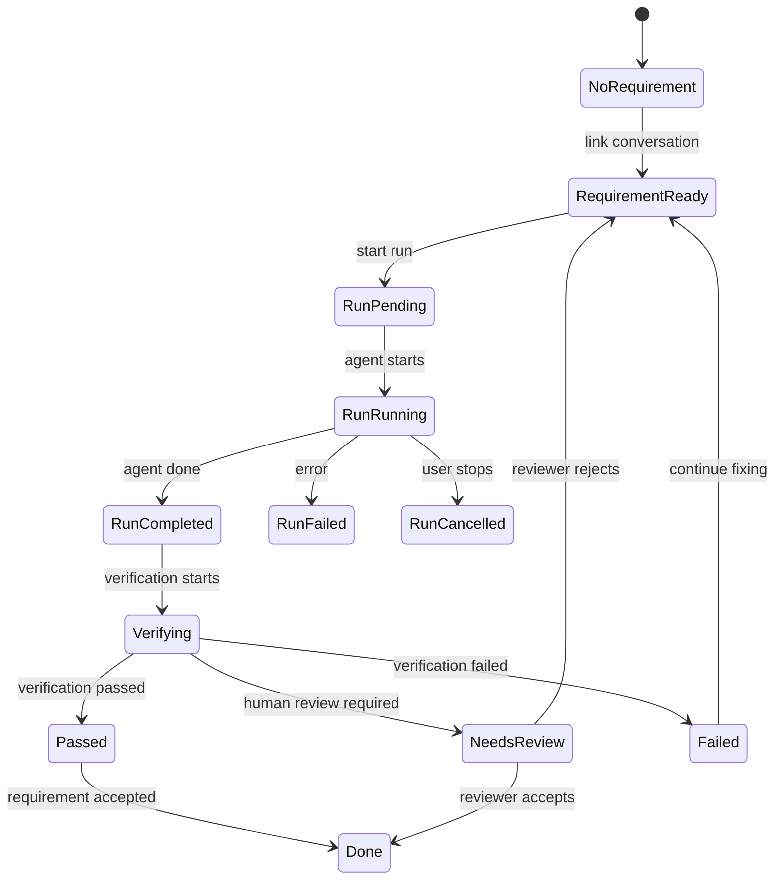

# 会话执行上下文条

**状态：** Proposed  
**涉及：** `apps/jarvis-web` 的会话中 composer、Requirement / RequirementRun /
Activity 的前端读取与 WS 同步、`crates/harness-server` 的会话工作上下文聚合接口、
已有 Git diff / branch composer shoulder。

## 背景

新建会话和会话中是两种 UI。

- **新建会话**先解决“这次会话绑定哪个项目 / 文件夹 / Free chat”；
- **会话中**要持续说明“这段对话正在推进什么需求、执行到哪一步、当前代码状态是什么”。

目前会话中 composer 已经向 Claude Code 风格靠近：输入框上方有 branch、diff、PR
入口一类的 Git 信息。但只有 Git 信息不够。Git 说明“代码现在是什么状态”，不能回答
“当前会话为什么存在、对应哪个需求、执行情况如何”。

Jarvis 已经有这些核心数据：

- `Requirement.conversation_ids`：需求与会话的关联；
- `RequirementRun`：需求的一次执行尝试，包含 `status`、`summary`、`error`、
  `verification`、`worktree_path`；
- `Activity`：需求时间线；
- WS frames：`requirement_run_started`、`requirement_run_finished`、
  `requirement_run_verified`、`activity_appended`。

这份 spec 定义会话中输入区上方的**执行上下文条**。它不改变新建会话资源选择，也不重新设计
Requirement / Run 数据模型。

## 目标

1. **会话中清楚显示当前需求。**  
   用户进入一个已有会话时，应能立即看到它关联的 Requirement 标题与状态，而不需要回到
   Work 看板猜。

2. **执行状态优先于 Git 状态。**  
   输入框上方第一层显示需求 / run / verification；第二层显示 branch / diff / PR。
   需求说明“为什么做”，Git 说明“代码如何变了”。

3. **复用现有 RequirementRun / Activity。**  
   第一版从现有 REST + WS 数据构建 UI，不新增平行状态机。

4. **不污染 Free chat。**  
   没有关联需求的会话不强行显示任务状态；最多显示轻量的 `Free chat` / 项目上下文。

5. **点击后能展开详情。**  
   底部条只做概览；点击后打开右侧详情抽屉，展示完整需求、run、验证、活动记录。

6. **和 Claude Code composer 结构兼容。**  
   视觉上保持紧凑、低噪声，不把输入区变成看板卡片。

## 非目标

- 不在本 spec 中重做新建会话资源管理弹框。
- 不改 Requirement / RequirementRun 的核心 Rust 类型。
- 不实现完整 Work 看板详情页替代品；这里只做会话内的上下文入口。
- 不要求第一版支持跨多个 Requirement 的复杂会话。一个会话如果关联多个需求，只展示一个主需求。
- 不把执行日志直接铺满 composer；日志进入详情抽屉。

## 信息架构

会话中 composer 上方建议固定为两层：

```text
[需求执行条]
REQ-24 · 优化设置页多语言支持      Running · 1m37s      验证中      打开详情

[Git 状态条]
main ← feat/new                    +13105 -912          Create draft PR

[输入框]
Type / for commands

[模式 / 工具 / 模型]
Auto mode   文档   +   麦克风             Opus 4.7M · Extra high
```

优先级：

1. `SessionExecutionShoulder`：Requirement / Run / Verification；
2. `GitComposerShoulder`：branch / diff / PR；
3. `ComposerInput`：输入框；
4. `ComposerMeta`：Auto mode、工具、模型。

如果没有需求上下文：

```text
[Git 状态条]
main ← feat/new                    +42 -3               Create draft PR

[输入框]
Type / for commands
```

不要显示空的执行条。

## 核心概念

### Conversation Work Context

前端渲染执行条需要一个聚合后的工作上下文：

```ts
interface ConversationWorkContext {
  conversationId: string;
  project?: Project | null;
  requirement?: Requirement | null;
  latestRun?: RequirementRun | null;
  recentActivities: Activity[];
}
```

派生规则：

1. 先从当前会话拿 `project_id`；
2. 加载该项目 requirements；
3. 找到 `conversation_ids` 包含当前 `conversationId` 的需求；
4. 如果命中多个，按以下优先级选择主需求：
   - 最新有 `running` / `pending` run 的 Requirement；
   - `updated_at` 最新的 Requirement；
   - `conversation_ids` 中最后一次链接当前会话的 Requirement；
5. 加载主需求的 runs，选择最新 run；
6. 加载主需求最近 activities。

第一版可以在前端用现有接口派生。后续建议加后端聚合接口。

### Session Execution Display

执行条不是完整卡片，只展示 4 组信息：

```ts
interface SessionExecutionDisplay {
  requirementLabel: string; // "REQ-24" 或短 id
  title: string;
  requirementStatus: RequirementStatus;
  runStatus?: RequirementRunStatus;
  verificationStatus?: VerificationStatus;
  elapsedLabel?: string;
  actionLabel: string;
  tone: "neutral" | "running" | "success" | "warning" | "danger";
}
```

文案映射：

| 数据 | 显示 |
|---|---|
| Requirement `backlog`，无 run | `Ready · 尚未开始` |
| Requirement `in_progress`，Run `pending` | `Queued` |
| Requirement `in_progress`，Run `running` | `Running · 1m37s` |
| Run `completed`，verification `passed` | `Passed` |
| Run `completed`，verification `needs_review` | `Needs review` |
| Run `failed` | `Failed` |
| Run `cancelled` | `Cancelled` |
| Requirement `review` | `Review` |
| Requirement `done` | `Done` |

中文界面可翻译为：

| 英文 | 中文 |
|---|---|
| Ready | 就绪 |
| Queued | 排队中 |
| Running | 执行中 |
| Verifying | 验证中 |
| Needs review | 待 review |
| Passed | 已通过 |
| Failed | 失败 |
| Cancelled | 已取消 |
| Done | 已完成 |

## 产品体验

### 常规执行中

```text
REQ-24 · 优化设置页多语言支持    执行中 · 1m37s    cargo test    打开详情
```

行为：

- 左侧点击：打开 Requirement 详情抽屉；
- `执行中` chip：打开当前 run 详情；
- `cargo test` / 验证 chip：打开验证结果区域；
- 右侧 action：根据状态变化。

### 验证失败

```text
REQ-24 · 优化设置页多语言支持    验证失败    cargo clippy failed    查看日志
```

视觉：

- 不用大面积红色背景；
- 使用红色文字 / 小状态点；
- 输入框仍保持可用，方便用户继续修复。

### 待 review

```text
REQ-24 · 优化设置页多语言支持    待 review    +13105 -912    打开详情
```

行为：

- 详情抽屉中显示验收标准、验证结果、最近 diff、完成 / 退回操作；
- composer 上方的 Git 条仍显示 PR 入口。

### 已完成

```text
REQ-24 · 优化设置页多语言支持    已完成    测试通过    查看记录
```

完成态不应该完全消失，因为用户回看会话时仍需要知道这段对话完成了什么。

### Free chat

没有 Requirement 时不显示执行条。输入区只保留 Git 条或项目上下文。

如果需要轻提示，可以在 Git 条左侧显示一个很小的状态：

```text
Free chat       main ← feat/new          +42 -3
```

但默认建议隐藏执行条，减少噪声。

## 详情抽屉

点击执行条打开右侧详情抽屉，宽度约 420-520px。

内容结构：

```text
Requirement
  标题
  状态 / assignee / triage
  描述
  验收标准 / verification plan

Latest run
  状态
  开始 / 结束时间
  summary
  error
  worktree path

Verification
  总状态
  命令列表
  stdout / stderr 摘要

Activity
  最近时间线

Actions
  继续执行 / 停止 / 重新验证 / 标记完成 / 退回
```

第一版 action 可以只做导航和只读详情；状态变更按钮可以后续补。

## 前端实现

建议新增：

```text
apps/jarvis-web/src/components/Composer/SessionExecutionShoulder.tsx
apps/jarvis-web/src/components/Composer/SessionExecutionDrawer.tsx
apps/jarvis-web/src/components/Composer/sessionExecutionDisplay.ts
apps/jarvis-web/src/hooks/useConversationWorkContext.ts
```

### `useConversationWorkContext`

职责：

- 输入：`conversationId`、`projectId`；
- 加载 project requirements；
- 找到与当前 conversation 关联的 requirement；
- 加载该 requirement 的 runs / activities；
- 订阅 requirement service cache；
- 响应 WS frame 更新。

第一版伪代码：

```ts
function useConversationWorkContext(
  conversationId: string | null,
  projectId: string | null,
): ConversationWorkContext | null {
  // 1. loadRequirements(projectId)
  // 2. listRequirements(projectId)
  // 3. find requirement where conversation_ids includes conversationId
  // 4. fetch /v1/requirements/:id/runs
  // 5. fetch /v1/requirements/:id/activities
  // 6. reduce WS updates into local state
}
```

### WS frame handling

现有 frames：

```json
{ "type": "requirement_run_started", "run": { ... } }
{ "type": "requirement_run_finished", "run": { ... } }
{ "type": "requirement_run_verified", "run_id": "...", "result": { ... } }
{ "type": "activity_appended", "activity": { ... } }
```

UI 处理规则：

- 如果 frame 的 `requirement_id` 命中当前主需求，更新执行条；
- `requirement_run_verified` 只有 `run_id`，需要用当前已知 `latestRun.id` 或 runs cache 匹配；
- `activity_appended` 插入详情抽屉 timeline；
- 未命中的 frame 忽略。

### 显示计算

`sessionExecutionDisplay.ts` 应该是纯函数，方便测试：

```ts
export function buildSessionExecutionDisplay(
  ctx: ConversationWorkContext,
  now: number,
): SessionExecutionDisplay | null;
```

测试覆盖：

- 无 requirement 返回 `null`；
- pending / running / completed / failed / cancelled；
- verification passed / failed / needs_review / skipped；
- run 缺失但 requirement 为 `review` / `done`；
- elapsed label 稳定输出。

## 后端聚合接口

第一版可以纯前端派生，但建议补一个聚合接口，避免 UI 多次请求和重复扫描。

```http
GET /v1/conversations/:id/work-context
```

响应：

```ts
interface ConversationWorkContextResponse {
  conversation_id: string;
  project: Project | null;
  requirement: Requirement | null;
  latest_run: RequirementRun | null;
  recent_activities: Activity[];
}
```

后端逻辑：

1. 从 `ConversationStore` 读取会话；
2. 读取会话的 `project_id`；
3. 从 `RequirementStore` 查该项目 requirements；
4. 用 `conversation_ids` 找关联需求；
5. 从 `RequirementRunStore` 查 runs；
6. 从 `ActivityStore` 查 recent activities；
7. store 未配置时返回可降级 shape，而不是整接口 500：

```json
{
  "conversation_id": "conv-1",
  "project": null,
  "requirement": null,
  "latest_run": null,
  "recent_activities": []
}
```

如果只缺 run / activity store，也应该返回 requirement，并将缺失部分置空。

## 布局规则

### Desktop

- composer 最大宽度沿用当前会话输入区；
- 执行条与 Git 条同宽；
- 执行条高度 40-48px；
- Git 条高度 36-44px；
- 输入框高度保持 Claude Code 风格；
- 不使用大卡片嵌套，不把条做成看板卡。

### Mobile / 窄屏

执行条压缩为两行：

```text
REQ-24 · 优化设置页多语言支持
执行中 · 1m37s · 验证中
```

右侧 action 收进更多菜单。

Git 条可折叠为：

```text
feat/new · +13105 -912
```

### 长标题

- 标题单行 ellipsis；
- hover / drawer 展示完整标题；
- 不允许挤压状态 chip 和操作按钮。

## 状态机



## 分阶段落地

### Phase 1：只读执行条

前端：

- 新增 `SessionExecutionShoulder`；
- 在会话中 composer 的 Git 条上方渲染；
- 前端根据 `Requirement.conversation_ids` 派生上下文；
- 请求 `GET /v1/requirements/:id/runs` 和 `GET /v1/requirements/:id/activities`；
- 点击执行条打开只读 drawer。

验收：

- 无需求会话不显示执行条；
- 有需求会话显示标题、状态、latest run；
- run failed / verification failed 有明确失败态；
- 新建会话 composer 不受影响。

### Phase 2：实时更新

前端：

- 接入 `requirement_run_started`；
- 接入 `requirement_run_finished`；
- 接入 `requirement_run_verified`；
- 接入 `activity_appended`；
- drawer timeline 实时追加。

验收：

- 另一个窗口触发 run，当前会话执行条能更新；
- verification 结束后状态 chip 不需要刷新页面；
- activity 顺序稳定。

### Phase 3：后端聚合接口

后端：

- 新增 `GET /v1/conversations/:id/work-context`；
- store 缺失时降级返回；
- 补单元测试覆盖无 project / 无 requirement / 有 run / 有 activity。

前端：

- `useConversationWorkContext` 优先使用聚合接口；
- 接口不可用时回退 Phase 1 派生逻辑。

### Phase 4：操作入口

可逐步加入：

- 继续执行；
- 停止当前 run；
- 重新验证；
- 标记完成；
- 退回 In progress；
- 打开 PR。

这些操作放 drawer 里，不放在执行条主视图里。

## 验收标准

- 会话中输入框上方可以同时展示“需求执行情况”和“Git 信息”，且需求执行情况在上。
- Free chat / 无需求会话不出现空状态噪声。
- 新建会话 composer 的资源选择 UI 不被改动。
- `RequirementRunStatus`、`VerificationStatus` 的关键状态都有稳定文案与视觉 tone。
- 需求标题过长、窗口变窄、验证失败、run 缺失等情况不破坏布局。
- 执行条点击后能打开详情抽屉，至少展示 requirement、latest run、verification、recent activities。
- 第一版不要求新增后端接口也可工作；聚合接口作为后续增强。
- `npm --prefix apps/jarvis-web run build` 通过。
- `SessionExecutionShoulder` / `sessionExecutionDisplay` 有 focused tests。

## 打开问题

1. 一个会话关联多个 Requirement 时，是否允许用户手动切换主需求？
2. 执行条是否需要显示 assignee / agent profile，还是只在 drawer 中显示？
3. verification command 的 stdout / stderr 摘要应该在 drawer 中截断多少字符？
4. `GET /v1/conversations/:id/work-context` 是否应该返回 Git diff 摘要，形成单一 composer context 接口？
5. 完成态的执行条是否长期保留，还是在一段时间后折叠为历史入口？
