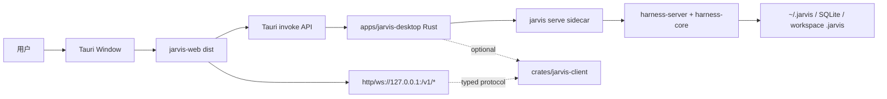

# Jarvis Desktop：Tauri 壳与 Server Sidecar

Status: **Proposed**

Owner: Jarvis

Related: [web-ui.md](web-ui.md), [new-session-resource-manager.zh-CN.md](new-session-resource-manager.zh-CN.md), [session-execution-context.zh-CN.md](session-execution-context.zh-CN.md)

## 背景

Jarvis 已经有可用的 `apps/jarvis-web` 和 Rust HTTP / WebSocket server。桌面端不应该重写一套 TUI，也不应该在前端里重新实现 agent runtime。目标是把现有 Web UI 包进 Tauri，并让 Rust 桌面层只负责系统集成：

- 启动、看护、关闭本地 `jarvis serve`
- 选择文件夹、打开文件、系统通知、托盘、窗口状态
- 读取系统级 `~/.jarvis/config.json`，但不重复实现 provider / model 配置逻辑
- 给 Web UI 提供稳定的桌面 IPC 边界

参考 `cc-haha-main/desktop` 后，Jarvis 应吸收其 sidecar 管理、托盘、窗口状态和 CSP 思路；不要吸收其终端 PTY、IM adapter、remote channel 等复杂模块作为第一版范围。

## 目标

1. 复用 `apps/jarvis-web`，桌面端首屏就是现有 Chat / Work / Settings UI。
2. Tauri Rust 侧启动本地 Jarvis server sidecar，并把 server URL 注入前端。
3. 前端仍通过现有 `/v1/*` HTTP 和 `/v1/chat/ws` 与 server 通讯。
4. 新增少量 `invoke` 命令处理系统能力：目录选择、打开路径、读取桌面状态、重启 server、查看日志。
5. 让桌面端可打包 macOS / Windows，Linux 暂不作为第一验收平台。

## 非目标

- 不做 TUI。
- 不把 `harness-core` 直接链接进桌面窗口进程来跑 agent loop。
- 不重写现有 Web UI。
- 不在 Tauri Rust 层维护第二套会话、项目、模型、权限状态。
- 第一版不做 IM 远程控制、内置终端、PTY、多机远程 session。

## MVP 版本

MVP 的目标不是做完整桌面 IDE，而是交付一个“可安装、可启动、可稳定使用现有 Web UI 的本地桌面工作台”。第一版只解决浏览器版本最明显的本地体验问题：启动 server、连接 server、选择工作目录、后台继续运行、失败可诊断。

### MVP 范围

1. **新增 `apps/jarvis-desktop`**
   - Tauri 2 应用。
   - 直接加载 `apps/jarvis-web/dist`。
   - 打包时把 `jarvis` 二进制作为 sidecar。
   - macOS 作为第一验收平台；Windows 只保证结构可迁移。

2. **Sidecar 生命周期**
   - App 启动时检查本地 `jarvis serve` 是否可用。
   - 如果 7001 已有可用 Jarvis server，直接复用。
   - 如果没有，启动内置 sidecar：`jarvis serve --workspace <workspace>`。
   - 自动选择可用端口，避免 7001 被占用时直接失败。
   - sidecar stdout/stderr 写入桌面日志缓冲，供 UI 查看。
   - 退出 App 时停止由桌面端启动的 sidecar；不杀用户自己启动的 server。

3. **前端接入**
   - Tauri 启动后把 `apiOrigin` 注入 Web UI。
   - Web UI 仍走现有 `fetch(apiUrl(...))` 和 `wsUrl()`。
   - 浏览器 Web 与桌面 Web 共用同一套 service，不 fork UI。
   - 如果 server 未就绪，显示桌面启动错误页：日志尾部、重试、选择工作目录。

4. **系统能力 IPC**
   - `desktop_status()`：返回 server URL、sidecar 状态、workspace、日志尾部。
   - `select_workspace_dir()`：调用系统目录选择器。
   - `restart_server(workspace?)`：重启由桌面端管理的 sidecar。
   - `open_path(path)`：用系统默认应用打开文件或目录。
   - `reveal_path(path)`：在 Finder / Explorer 中定位。

5. **工作目录**
   - 首次启动默认使用上次 workspace。
   - 没有上次 workspace 时，默认 `~/Documents/GitHub` 或用户主目录，并提示选择。
   - 用户选择目录后：
     - 写入桌面偏好。
     - 重启 sidecar。
     - Web UI 通过已有 workspace / projects API 刷新。

6. **多会话与异步运行**
   - MVP 复用当前 server-side chat run registry。
   - 桌面端关闭窗口到托盘时，server 继续运行。
   - Web UI 通过 `/v1/chat/runs` 与 `/events?after=` 恢复运行状态。
   - MVP 不新增完整 `/v1/runs/:run_id` API；先使用当前 conversation-scoped run registry。

7. **托盘与窗口**
   - 关闭窗口默认隐藏到托盘。
   - 托盘菜单：
     - Show Jarvis
     - Restart Server
     - Open Logs
     - Quit
   - Quit 时如果有 active runs：
     - MVP 可先提示“仍有任务运行中，退出会停止本地 server”，用户确认后退出。

### MVP 非范围

- 不做内置终端 / PTY。
- 不做完整文件管理器。
- 不做自动更新。
- 不做账号体系。
- 不做远程控制 / IM bot。
- 不做多 server profile。
- 不做云同步。
- 不做 `crates/jarvis-client` 完整 SDK。
- 不重做 Settings；模型、Provider、权限仍在现有 Web Settings 中配置。

### MVP 推荐目录结构

```text
apps/
  jarvis-desktop/
    Cargo.toml
    tauri.conf.json
    build.rs
    src/
      main.rs
      sidecar.rs
      commands.rs
      state.rs
      logs.rs
      tray.rs
    capabilities/
      default.json
```

`apps/jarvis-desktop/src` 只负责桌面壳，不放业务逻辑。业务 API 仍在 `harness-server`，前端业务状态仍在 `apps/jarvis-web`。

### MVP 前端改动

前端只需要很薄的桌面适配层：

```text
apps/jarvis-web/src/services/desktop.ts
```

职责：

- 检测是否在 Tauri 环境。
- 调用 `desktop_status()` 读取 `apiOrigin`。
- 写入现有 `jarvis.apiOrigin` 或提供 runtime override。
- 暴露 `selectWorkspaceDir()` / `restartDesktopServer()` / `openPath()`。

现有 `api.ts` 只需增加一个运行时 origin override，不把 Tauri import 散落到业务组件里。

### MVP 验收标准

1. 双击 Jarvis Desktop 后能打开现有 Web UI。
2. 没有外部 server 时，桌面端能自动启动 sidecar。
3. Web UI 的 Chat / Projects / Settings 可以正常访问后端。
4. 用户可以选择 workspace，并让 sidecar 以该 workspace 重启。
5. 新建会话、发送消息、切换会话、后台运行状态正常。
6. 关闭窗口到托盘后，后台 run 不被中断。
7. 从托盘恢复窗口后，运行中会话状态能恢复。
8. server 启动失败时，用户能看到错误与日志尾部，并可重试。
9. `npm run build`、`cargo build -p jarvis`、`cargo build -p jarvis-desktop` 通过。

### MVP 分阶段交付

| 阶段 | 交付 | 验收 |
|---|---|---|
| M0 | Tauri scaffold + 加载 `jarvis-web/dist` | 桌面窗口能显示 Web UI |
| M1 | sidecar 启动 / health check / apiOrigin 注入 | Web UI 能连到本地 server |
| M2 | workspace 选择 + restart server | 切换 workspace 后后端 root 更新 |
| M3 | 日志面板 + 启动失败页 | server 失败可诊断、可重试 |
| M4 | 托盘 + close-to-tray + quit guard | 关闭窗口不杀 run，退出有确认 |
| M5 | 打包配置 | macOS 本地安装包可运行 |

## 产品形态

桌面端等价于“本地 Jarvis 工作台”：

- 用户打开 App 后，桌面壳确保本地 server 可用。
- Web UI 从 Tauri 获取 server URL，并使用当前已有 API。
- 如果 server 启动失败，前端显示一个桌面启动错误页，包含日志尾部和重试按钮。
- 关闭窗口默认隐藏到托盘；退出 App 时停止 sidecar。
- 多个会话可以同时运行；用户切到别的会话、项目页或设置页时，后台 run 不应中断。
- 异步 run 由 server 管理，桌面窗口只负责订阅和展示状态。

## 架构



关键原则：

- **Web 是产品 UI。** 桌面端只决定如何启动和接入 server。
- **Server 是单一业务后端。** 所有会话、项目、权限、MCP、skills、plugins 都继续走现有 REST / WS。
- **IPC 只做系统能力。** 不通过 IPC 旁路修改业务状态，避免 Web 和 Server 状态分叉。

## 多会话与异步运行

当前 `/v1/chat/ws` 的模型是“一个 WebSocket socket 持有一个 conversation mirror，同一个 socket 同时只允许一个 turn”。这已经天然支持**多个 socket 并行**，因此多个会话同时跑在技术上不是 agent loop 的问题，而是产品和 server 生命周期的问题：

- 如果每个会话页/标签持有自己的 socket，则多个会话可以并行。
- 但 run 的事件流仍然依赖那个 socket；用户切换 UI、刷新页面、关闭窗口后，事件订阅和 run 生命周期会变得脆弱。
- 真正的“异步跑”需要 server-side run registry：run 属于 server，不属于某个窗口连接。

### 目标形态

Jarvis 应支持两种运行模式：

| 模式 | 适用场景 | 生命周期 |
|---|---|---|
| Foreground turn | 当前会话中用户等待回复 | 沿用 `/v1/chat/ws`，socket 断开则 UI 不再接收事件 |
| Background run | 多会话并行、长任务、切走继续跑、关闭到托盘继续跑 | 新增 server-side run registry，UI 可随时 attach / detach |

桌面端第一版可以先把所有会话 run 都走 Background run；浏览器 Web UI 可继续使用 foreground WS，等协议稳定后再统一。

### Server-side Run Registry

新增一个进程内 `SessionRunRegistry`，放在 `harness-server`，由 `AppState` 持有：

```text
SessionRunRegistry
  runs: HashMap<run_id, SessionRunHandle>

SessionRunHandle
  run_id
  conversation_id
  project_id?
  workspace_path?
  provider/model
  status: queued | running | waiting_approval | waiting_hitl | completed | failed | cancelled
  created_at / started_at / finished_at
  event_log: VecDeque<AgentEventFrame>
  event_tx: broadcast::Sender<AgentEventFrame>
  control_tx: mpsc::Sender<RunControl>
```

约束：

- 默认同一个 `conversation_id` 同时只允许一个 active run，避免两个 agent 同时写同一段 history。
- 不同 conversation 可以并行运行。
- 同一个 project 下多个 conversation 可以并行，但工具层仍受各自 workspace / permission mode 约束。
- run 结束时保存 conversation envelope。
- run 的 event log 保留最近 N 条或最近 M KiB，供 UI 重新 attach 时补帧。
- 第一版 run registry 是进程内的；server 重启后 running run 不恢复，只保留已保存的 conversation。

### 新 API

建议新增一组专门的 async run API，不挤进现有 `/v1/chat/ws`：

| Endpoint | 作用 |
|---|---|
| `POST /v1/conversations/:id/runs` | 向会话追加用户消息并启动后台 run |
| `GET /v1/conversations/:id/runs` | 列出该会话 run 历史/活跃状态 |
| `GET /v1/runs` | 列出所有 active / recent runs |
| `GET /v1/runs/:run_id` | 获取 run 状态、conversation_id、provider/model、当前等待项 |
| `GET /v1/runs/:run_id/events` | SSE 订阅事件；支持 `?after=<seq>` 补帧 |
| `POST /v1/runs/:run_id/interrupt` | 取消 run |
| `POST /v1/runs/:run_id/approve` | 响应工具审批 |
| `POST /v1/runs/:run_id/deny` | 拒绝工具审批 |
| `POST /v1/runs/:run_id/hitl` | 响应 `ask.*` / HITL 请求 |

`POST /v1/conversations/:id/runs` body：

```json
{
  "content": "实现这个需求",
  "provider": "kimi-code",
  "model": "kimi-k2.6",
  "workspace_path": "/Users/me/project",
  "project_id": "jarvis",
  "permission_mode": "ask",
  "soul_prompt": null
}
```

返回：

```json
{
  "run_id": "run_...",
  "conversation_id": "...",
  "status": "queued"
}
```

### 事件协议

后台 run 的事件应带稳定序号，方便 UI 断线补帧：

```json
{
  "seq": 42,
  "run_id": "run_...",
  "conversation_id": "...",
  "event": { "type": "delta", "content": "..." }
}
```

UI attach 流程：

1. `GET /v1/runs/:run_id` 读取快照。
2. `GET /v1/runs/:run_id/events?after=<last_seq>` 订阅增量。
3. 如果 SSE 断线，按最后 seq 重连。
4. run terminal 后，UI 刷新 `GET /v1/conversations/:id` 获取最终 history。

### 权限与 HITL

后台 run 不能依赖某个 WS socket 的 `ChannelApprover`。需要把审批 responder 挂到 `SessionRunHandle`：

- run 产生 approval request：
  - status 变为 `waiting_approval`
  - event_log 追加 approval frame
  - `pending_approvals[tool_call_id] = responder`
- 任意 UI 客户端可以调用 approve / deny。
- 成功响应后 status 回到 `running`。
- 如果多个 UI 同时响应，同一 `tool_call_id` 只有第一个生效，其余返回 409。

HITL 同理：

- `pending_hitl[request_id] = responder`
- `POST /v1/runs/:run_id/hitl` 唤醒 agent。

### 桌面 UI 行为

桌面端需要把“当前会话”与“正在运行的 run”分开：

- 左侧会话列表显示运行态：running / waiting approval / failed / done。
- 输入区上方的执行上下文条显示当前会话 active run。
- 用户切换会话时：
  - 如果目标会话有 active run，自动 attach 事件流。
  - 如果没有 active run，展示 persisted conversation。
- 顶部或底部提供全局 Running 面板，列出所有 active runs。
- 关闭窗口到托盘时 run 继续跑。
- 真正退出 App 时，如果有 active runs，提示“仍有 N 个任务运行中：后台继续 / 取消并退出 / 返回”。

### `crates/jarvis-client` 的影响

有了 async run API 后，`crates/jarvis-client` 仍保持薄，但需要多几个 typed 方法：

- `start_run(conversation_id, StartRunRequest)`
- `list_runs(filter)`
- `get_run(run_id)`
- `subscribe_run_events(run_id, after_seq)`
- `interrupt_run(run_id)`
- `approve_run_tool(run_id, tool_call_id)`
- `deny_run_tool(run_id, tool_call_id, reason)`
- `respond_run_hitl(run_id, request_id, payload)`

这仍不是完整 SDK；它只是 async run wire protocol 的 Rust 类型和 transport。

## 是否需要 `crates/jarvis-client`

结论：**需要，但第一版只做薄协议层，不做完整 SDK。**

桌面端本身可以直接用前端 `fetch` / WebSocket 调现有 server；Tauri Rust 侧只管理 sidecar，看起来似乎不需要 client crate。但 Jarvis 已经有大量 typed event / control frame，如果不抽一层，后续会出现三份重复逻辑：

- `jarvis-web` 的 TypeScript API service
- `apps/jarvis-desktop` 的 Rust 健康检查 / server info / 日志诊断
- 未来自动化、测试、CLI、脚本对 `/v1/chat/ws` 的消费

因此建议新增 `crates/jarvis-client`，但控制范围：

### 第一版包含

- HTTP 小客户端：
  - `health()`
  - `server_info()`
  - `providers()`
  - `workspace()`
- WS 协议类型：
  - `WsClientMessage`
  - server event 的 serde mirror
  - approval / HITL / interrupt / configure / set_workspace frame
- URL 工具：
  - `http_base -> ws_base`
  - loopback URL 校验
- 错误类型：
  - network
  - protocol
  - server response

### 第一版不包含

- 不做高级 session manager。
- 不做 reconnect 策略。
- 不做前端状态 store。
- 不读写 `~/.jarvis/config.json`。
- 不把 provider/model 业务规则复制到 client。
- 不做 TUI 适配。

换句话说，第一版 `jarvis-client` 更像 **typed protocol crate**，不是产品 SDK。

### 后续可扩展

当桌面端和自动化脚本都稳定后，再考虑加：

- `SessionClient`：封装 `new/resume/user/approve/deny/interrupt`
- reconnect + ping
- typed event reducer
- 测试 harness：启动临时 server，跑 WS golden tests

如果一开始就把这些都做完，容易变成另一个 runtime；这会和“桌面端只做系统集成”的原则冲突。

## 目录结构

建议新增：

```text
crates/
  jarvis-client/
    Cargo.toml
    src/
      lib.rs
      http.rs
      protocol.rs
      url.rs
      error.rs
apps/
  jarvis-desktop/
    package.json
    index.html
    vite.config.ts             # 可复用 jarvis-web dist，或作为 Tauri dev shell
    src-tauri/
      Cargo.toml
      tauri.conf.json
      build.rs
      src/
        main.rs
        lib.rs
        server_sidecar.rs
        config.rs
        window_state.rs
        commands.rs
        tray.rs
```

两种前端复用方式：

1. **推荐第一版：Tauri frontendDist 指向 `../jarvis-web/dist`。**
   - `beforeBuildCommand = "cd ../jarvis-web && npm run build"`
   - 不复制前端代码。
   - Vite dev 时仍运行 `apps/jarvis-web`。
2. 后续如果桌面需要很薄的启动页，再在 `apps/jarvis-desktop/src` 放少量 desktop-only shell。

## Server Sidecar 生命周期

Rust 桌面层负责：

1. 选择端口：优先读取 `~/.jarvis/config.json` 的 `desktop.server_port`；未设置则从 `127.0.0.1:0` 分配空闲端口。
2. 启动 sidecar：

   ```bash
   jarvis serve --addr 127.0.0.1:<port>
   ```

3. 注入环境：
   - `JARVIS_CONFIG_HOME=~/.jarvis`
   - `JARVIS_ADDR=127.0.0.1:<port>`
   - 保留用户已有 provider env，不在桌面端复制 secrets。
4. 健康检查：
   - 轮询 `GET /health`
   - 成功后向前端提供 `server_url`
   - 失败时保留最近 N 行 stdout/stderr
5. 退出：
   - App 正常退出时停止 sidecar
   - 关闭窗口默认隐藏到托盘，不停止 sidecar
6. 崩溃恢复：
   - sidecar 意外退出时标记 `server_status = stopped`
   - 前端显示“重新启动”入口
   - 不自动无限重启，避免配置错误时循环刷日志

## 前端接入

现有 `jarvis-web` 需要增加一个轻量 runtime resolver：

```ts
type JarvisRuntime =
  | { kind: "browser"; baseUrl: "" }
  | { kind: "desktop"; baseUrl: string };
```

规则：

- 浏览器/开发模式：继续使用相对路径或 Vite proxy。
- Tauri 模式：调用 `invoke("get_server_url")`，把 `/v1` 和 `/health` 请求指向该 base URL。
- WebSocket 同理从 `http://` / `https://` 转成 `ws://` / `wss://`。

这要求当前前端服务层不要散落硬编码 `fetch("/v1/...")` 的拼接逻辑；应收敛到一个 `apiBase()` / `wsBase()` helper。

## Tauri IPC 命令

第一版只保留必要命令：

| 命令 | 作用 | 返回 |
|---|---|---|
| `get_server_url` | 返回本地 sidecar URL | `{ url }` |
| `get_server_status` | 返回启动状态、pid、端口、最近日志 | `{ state, url?, logs[] }` |
| `restart_server` | 停止并重启 sidecar | `{ state }` |
| `select_directory` | 系统目录选择器，用于新建会话资源管理 | `{ path } | null` |
| `reveal_path` | 在 Finder / Explorer 中显示路径 | `ok` |
| `open_external` | 用系统浏览器打开 URL | `ok` |
| `get_desktop_config` | 返回桌面偏好，不含 secrets | `{ closeToTray, serverPort?, theme? }` |
| `save_desktop_config` | 保存桌面偏好到 `~/.jarvis/config.json` 的 `desktop` section | `ok` |

不要用 IPC 暴露：

- 任意 shell 执行
- 任意文件读写
- provider API key
- 数据库 URL 明文
- 绕过 server 权限系统的会话操作

## 配置

系统配置继续使用 `~/.jarvis/config.json`。新增可选 section：

```json
{
  "desktop": {
    "server_port": 7001,
    "auto_start_server": true,
    "close_to_tray": true,
    "show_dock_icon": true,
    "last_window": {
      "width": 1440,
      "height": 960,
      "x": 120,
      "y": 80,
      "maximized": false
    }
  }
}
```

说明：

- `providers`、`default_provider`、`memory`、`approval` 等仍由 `apps/jarvis` 读取。
- 桌面端只读写 `desktop` section。
- 如果 `~/.config/jarvis` 仍存在，迁移逻辑由现有 config/auth 兼容策略处理；桌面端默认指向 `~/.jarvis`。

## 安全边界

1. Sidecar 只监听 `127.0.0.1`，不使用 `0.0.0.0`。
2. Tauri CSP 只允许：
   - `self`
   - `http://127.0.0.1:*`
   - `ws://127.0.0.1:*`
   - 必要的 `asset:` / `blob:` / `data:`
3. 文件选择必须由系统 dialog 返回路径；前端不能传任意路径要求 Rust 读取内容。
4. 打开路径、显示路径等命令必须做 existence check。
5. Server 权限仍走 Jarvis permission mode / rule engine，桌面端不新增 bypass。

## 打包

`apps/jarvis-desktop/src-tauri/tauri.conf.json` 建议：

```json
{
  "productName": "Jarvis",
  "identifier": "ai.jarvis.desktop",
  "build": {
    "frontendDist": "../../jarvis-web/dist",
    "beforeBuildCommand": "cd ../jarvis-web && npm run build",
    "devUrl": "http://127.0.0.1:5173",
    "beforeDevCommand": "cd ../jarvis-web && npm run dev"
  },
  "bundle": {
    "active": true,
    "targets": "all",
    "externalBin": ["binaries/jarvis"]
  }
}
```

sidecar 来源有两种：

- 开发期：直接调用 workspace 里的 `target/debug/jarvis`
- 发布期：把 `target/release/jarvis` 作为 Tauri `externalBin`

## 分阶段

### Phase 0：骨架

- 新建 `crates/jarvis-client`，只放 health / server_info / provider 的 HTTP client 与 WS frame 类型。
- 新建 `apps/jarvis-desktop`
- Tauri 打开现有 `jarvis-web/dist`
- 实现 `get_server_url`
- 开发期能连接手动启动的 `jarvis serve`

验收：

- `npm run build` 可生成 web dist
- `cargo check` 可通过 Tauri Rust 代码
- `cargo check -p jarvis-client` 通过
- 桌面窗口能显示现有 Jarvis Web UI

### Phase 1：Sidecar 管理

- Rust 自动分配端口并启动 `jarvis serve`
- 健康检查和日志缓存
- 前端 runtime resolver 支持 desktop base URL
- 退出 App 停止 sidecar

验收：

- 双击桌面 App 可自动启动 server
- Settings 能看到 server info
- Chat WS 可正常流式响应
- server 崩溃时 UI 可提示并重启

### Phase 1.5：多会话并行

- Web UI 允许多个 persisted conversation 同时持有运行态。
- 每个 active conversation 独立连接 foreground WS 或复用一个 run subscription。
- 会话列表展示 per-conversation running / waiting / failed 状态。
- 切换会话不打断其他会话。

验收：

- A 会话运行时，切到 B 会话并发起新 run，A/B 都能完成。
- A 会话等待审批时，B 会话仍可继续运行。
- 左侧会话列表实时反映两个会话的运行状态。

### Phase 1.6：异步后台 Run Registry

- `harness-server` 新增 `SessionRunRegistry`。
- 新增 `/v1/conversations/:id/runs` 与 `/v1/runs*` API。
- 支持 run events SSE、断线按 seq 补帧。
- 支持后台 approval / deny / HITL / interrupt。
- 桌面端默认使用后台 run API。

验收：

- 运行中的会话切走、刷新、关闭窗口到托盘后继续执行。
- 重新打开窗口可 attach 到 active run 并继续看到事件。
- 同一个 conversation 同时启动第二个 run 返回 409。
- 多个 conversation 可同时运行。
- run 完成后 conversation history 被保存。

### Phase 2：系统集成

- 系统目录选择器接入新建会话资源管理弹框
- Finder / Explorer reveal
- 托盘、关闭到托盘、窗口状态保存
- 系统通知：长任务完成、权限等待、server 异常

验收：

- 新建会话可通过 native dialog 选择多个项目文件夹
- 重启 App 恢复窗口尺寸
- 权限等待可发系统通知

### Phase 3：发布

- macOS arm64 打包
- Windows x64 打包
- release 构建脚本
- 签名/自动更新作为后续独立 PR

验收：

- 发布包包含 `jarvis` sidecar
- 无需用户手动启动 server
- 旧 `~/.config/jarvis` 用户可正常读取配置，迁移后优先使用 `~/.jarvis`

## 需要改动的 Jarvis 代码

### `apps/jarvis-web`

- 新增 runtime API base resolver。
- 将散落的 `/v1` 和 WS URL 构造收敛到统一 helper。
- 新建会话资源管理弹框可优先使用 Tauri directory picker；浏览器环境保留手动输入 / 最近项目选择。

### `apps/jarvis`

- 确保 `serve --addr 127.0.0.1:0` 或桌面传入端口的路径稳定。
- server info 继续不暴露 secrets。
- 日志输出保持可被桌面 sidecar 捕获。

### `crates/harness-server`

- 新增 `SessionRunRegistry` 和 async run routes。
- 把当前 WS run 的 per-turn 组装逻辑抽出可复用函数，避免 foreground WS 和 background run 各自复制 project/todo/skill/soul/permission 逻辑。
- 后台 run 的 permission / HITL responder 不能绑定到某个 WebSocket；需要 registry 级 pending map。
- 为 active run 提供 broadcast event stream 和 bounded event log。

### `crates/jarvis-client`

- 新增薄客户端和协议类型。
- 只依赖 `reqwest`、`tokio-tungstenite`、`serde`、`serde_json`、`thiserror`、`url` 等 transport 依赖。
- 不依赖 Tauri，不依赖 `harness-core` 的 agent loop 实现。
- 如果复用 `harness-core::AgentEvent` 会牵动过多内部类型，则先定义外部 wire DTO，保持 client crate 对 server wire protocol 的最小耦合。

### `apps/jarvis-desktop`

- 新增 Tauri 工程。
- 实现 sidecar 管理、IPC、窗口/托盘系统集成。

## 风险与应对

| 风险 | 应对 |
|---|---|
| 前端请求 URL 分散，桌面 base URL 难注入 | 先做 `apiBase` / `wsBase` 收敛 PR |
| sidecar 打包路径在 dev/release 不一致 | `server_sidecar.rs` 明确两套解析策略并加单元测试 |
| 端口冲突 | 默认随机端口；固定端口只作为用户配置 |
| server 启动失败用户看不懂 | 启动错误页展示最近日志和 config path |
| CSP 拦截 WS / assets | 第一版 CSP 最小放行 loopback 和本地资源 |
| 桌面端绕过权限 | IPC 不提供业务写操作，所有 agent 行为仍走 server |

## 参考项目吸收点

从 `cc-haha-main/desktop` 吸收：

- Tauri `externalBin` sidecar 打包
- `get_server_url` 风格的 IPC
- sidecar stdout/stderr 日志缓存
- 托盘显示/退出分离
- 窗口尺寸持久化与屏幕可见性校验
- CSP 只放行 loopback API / WS

明确不吸收：

- 内置 PTY terminal
- IM adapter sidecar
- remote CCR session protocol
- Electron/React 状态模型
- TUI PromptInput 复杂度

## 最小验收清单

- 桌面 App 首次启动能自动启动 Jarvis server。
- Web UI 无需知道 sidecar 细节，只拿到 base URL。
- 新建会话、发送消息、流式响应、权限确认正常。
- 关闭窗口隐藏到托盘；退出应用停止 server。
- `~/.jarvis/config.json` 是系统级配置源。
- 旧 `~/.config/jarvis` 数据兼容。
- macOS arm64 可打包运行。
